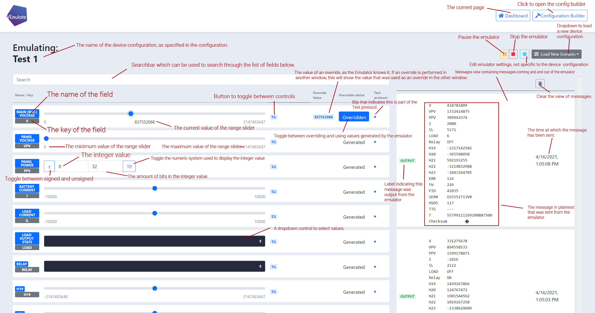
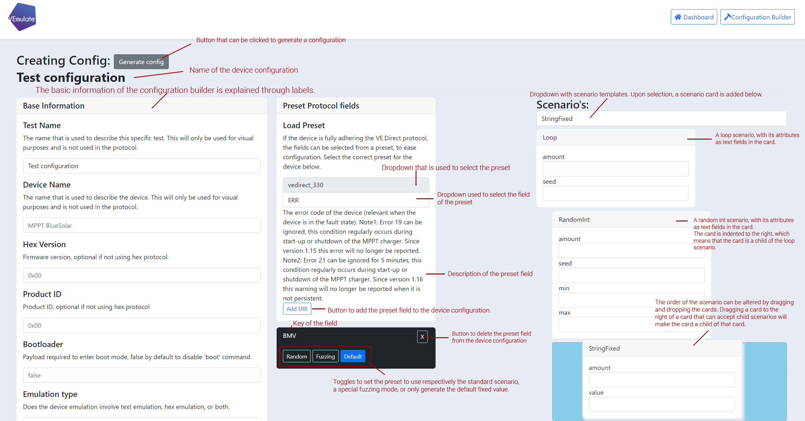

# VEmulator GUI
VEmulator allows the emulation of devices that use the VE.Direct text and/or hex protocol. 

This is the GUI of VEmulate, which is made up of a React Webapp that connects through a websocket via a local Flask webserver to the VEmulator Core. The GUI needs the VEmulator core submodule to operate corerctly, this module can be found [here](https://github.com/jeltevanbommel/VEmulate-Core-Public). The module contains a more detailed explanation about the working of the VEmulator. and is automatically included as a git submodule. 

Also see the [Vemulator-CLI](https://github.com/jeltevanbommel/VEmulate-CLI-public) package for a Command Line Interface.

## Installing 

`git clone https://github.com/jeltevanbommel/VEmulate-GUI-public.git --recursive `
### VEmulator's GUI Backend
If a virtual environment is desired, the following command can be ran:

`python3.9 -m virtualenv venv`

`. venv/bin/activate`

After this, all the required packages and the GUI can be installed using

`pip install -r requirements.txt`

Depending on your Python installation, it may be necessary to run the following command from the VEmulator-GUI root folder:

`pip install -e ./emulator`

### VEmulator's  GUI Frontend
The frontend has to be built using React (prerequisite: Node.js), for convenience, a pre-built build is included in the revision. 

To build the frontend navigate to the web folder, which is the package dir for the frontend:

`cd web`

Run the following script to begin installing all dependencies for the frontend

`npm install`

Now build the web resources

`npm run-script build`

## Running
The frontend can be started by executing `vemulator-gui` in a shell, or alternatively in this directory by executing
`python3 ws.py`
A Flask webserver will be started on port `3030`, navigate to `http://localhost:3030` in a browser to access the GUI

## The interface
The VEmulate interface has not been cluttered with tooltips and labels, and as such requires a bit of prior knowledge to understand.
The image below provides an explanation of the features in the user interface for the override dashboard.

## Warning
VEmulate's core contains the possibility to execute arbitrary code via `Arithmetic` scenario's. Running the webserver on a public network risks potential code execution. Use a firewall to protect port `3030` or setup a proxy with authentication, e.g. using `nginx`.
